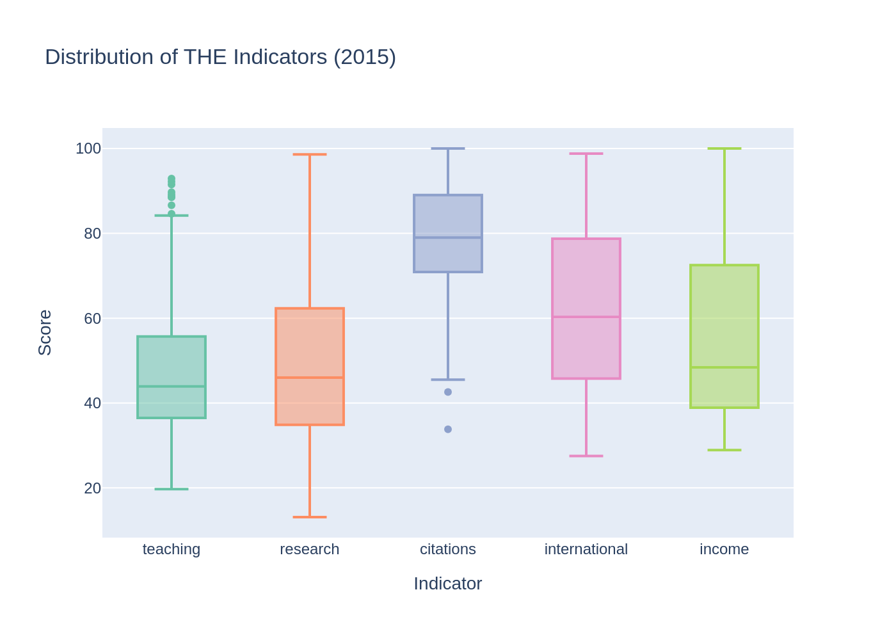
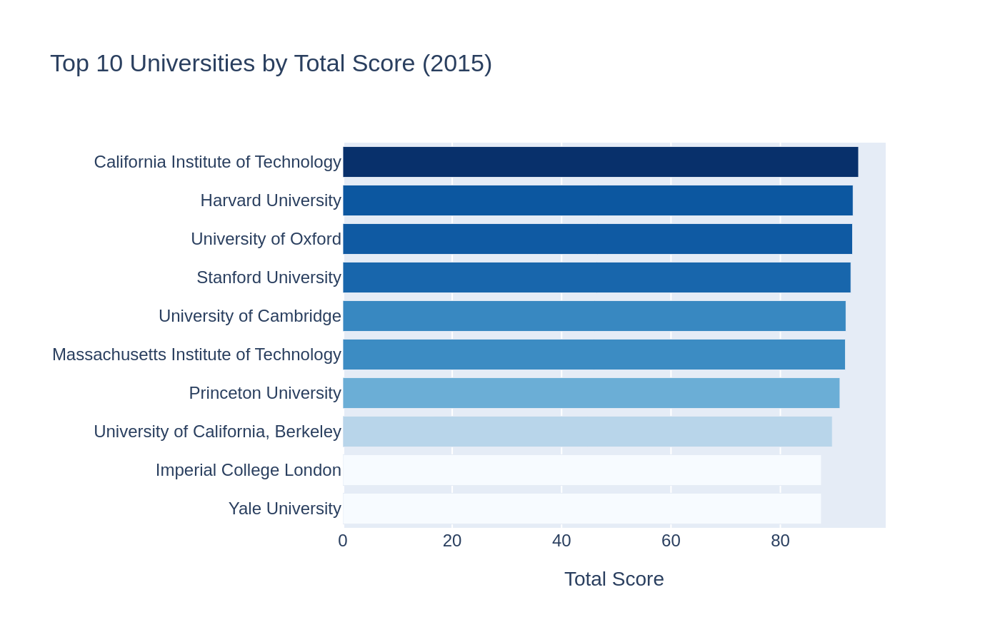
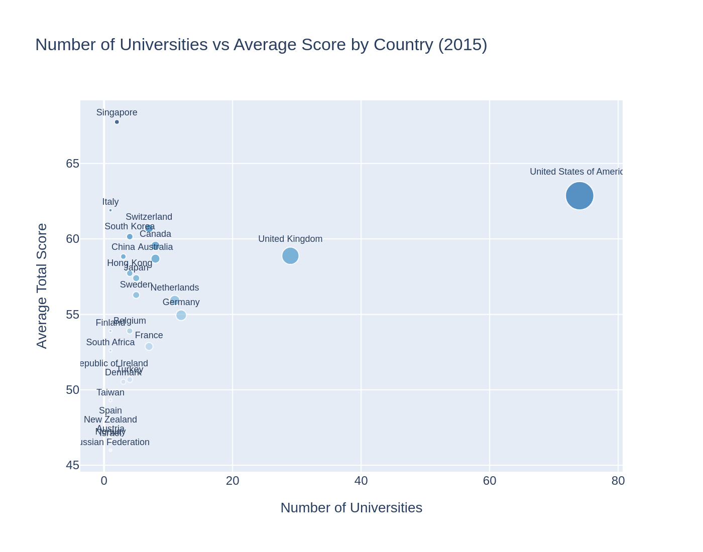
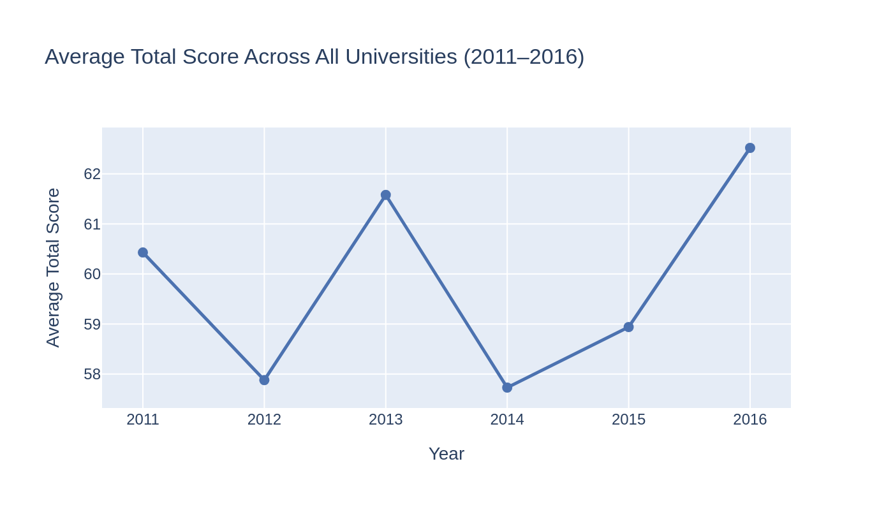
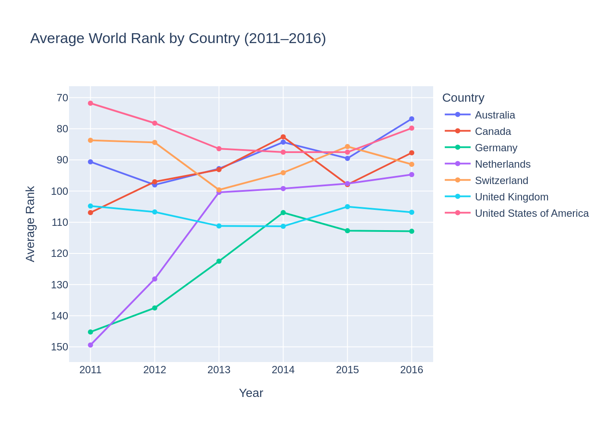
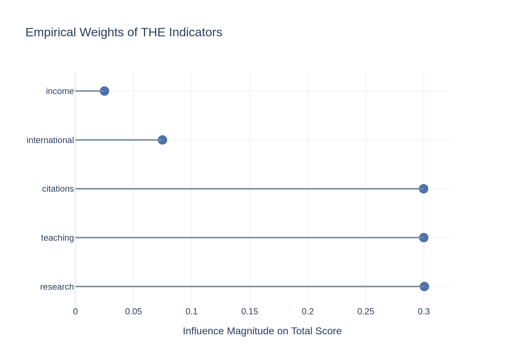



# Introduction and Problem Statement

## Introduction

Every year a lot of university rankings are published over the world. The Times Higher Education World University Rankings is one of the famous and influential ones.

Students look at this ranking when they are choosing a university. Governments use it when they are deciding how to give out money. Employers also look at it when they are evaluating degrees. So it is a deal for universities to be in the top 100 of this ranking.

Behind each single row in a table lies a complex system of indicators:

- Teaching
- Research 
- Citations
- International 
- Income

Each of these things contributes to the score but how much does each one matter? Are they all equally important?

This research is not trying to make a ranking. It is trying to use data analysis and math to understand what is behind the ranking.

## Problem Statement

The Times Higher Education ranking is made by adding up five indicators. The weights for each indicator are public [@the_methodology]. There might be a difference between what is supposed to happen and what actually happens.

The big question is: which of the five indicators has the effect on a university’s final position in the ranking?

## Why This Is Mathematically Interesting

From a math perspective a university's final score is like a function of variables. This means we can use math tools to understand how the ranking works.

For example we can look at the gradient of the scoring function. This tells us which way to move to improve the score the most.

So this research is at the intersection of data analysis and math. We are using data to test out math concepts.

# Data

## Source

Data was got from the World University Rankings dataset on Kaggle, which was published by Myles O’Neill[@oneill_rankings]. This dataset has information from three ranking systems: Times Higher Education, Academic Ranking of World Universities and the Center for World University Rankings.

This research uses exclusively the `timesData.csv` file, which contains data from the Times Higher Education ranking.

## Data Structure

The original dataset has information from 2011 to 2016. It includes 2,603 records for 818 universities from 72 countries. Each row is for one university in a given year.

The dataset has 14 variables.

| Variable                 | Description                                |
|:-------------------------|:-------------------------------------------|
| `world_rank`             | University position in the ranking         |
| `university_name`        | University name                            |
| `country`                | Country                                    |
| `teaching`               | Quality of the educational environment     |
| `international`          | Degree of internationalization             |
| `research`               | Volume and reputation of research activity |
| `citations`              | Citations of scientific publications       |
| `income`                 | Income from interaction with industry      |
| `total_score`            | Total weighted score                       |
| `num_students`           | Total number of students                   |
| `student_staff_ratio`    | Student-to-faculty ratio                   |
| `international_students` | Proportion of international students       |
| `female_male_ratio`      | Female-to-male ratio                       |
| `year`                   | Ranking year                               |

: Description of dataset variables

## Data Cleaning

Several issues were identified during the initial review:

- Range ranks: THE publishes detailed scores only for the top 200. The remaining records contain ranges like `"201–250"` without a `total_score` value. These rows were removed, leaving 1,200 records after filtering.
- Hyphens instead of missing values: the `"-"` symbol was replaced with `NaN`. The `income` metric was most affected, with 11.7% missing values.
- Irrelevant columns: several variables not needed for the analysis were removed from the dataset, including `num_students`, `student_staff_ratio` and `female_male_ratio`.

## Dataframes for Analysis

Two dataframes were created following the cleaning process:

- `df_all` - all years after cleaning (1,201 records).
- `df_2015` - 2015 only (201 records).

2015 was chosen because it was the year before THE expanded its ranking from approximately 400 to 800 universities in 2016.

# Exploratory Data Analysis

## Purpose of the EDA

Exploratory Data Analysis serves as a bridge between data preparation and the main mathematical analysis. The goal of this section is visualize the dataset, understand its structure, inspect the distribution of the main indicators.

## Geographic Distribution of Universities

The first step was to examine how universities are distributed across countries. The results show a strong geographic concentration.

{#fig-geography fig-pos='H' fig-align="center" width=100%}

The United States clearly dominates the dataset. After the US comes UK and then Germany. After these leading countries, the number of universities drops sharply.

This suggests that the global elite of universities is concentrated primarily in North America and Western Europe.

## Distribution of the Main Indicators

To better understand the internal structure of the ranking, the five main indicators were analyzed using histograms, box plots, and descriptive statistics.

|               | Mean  | Std   | Min  | 25%  | Median | 75%  | Max   |
|:--------------|:------|:------|:-----|:-----|:-------|:-----|:------|
| teaching      | 48.17 | 16.52 | 19.7 | 36.5 | 43.9   | 55.6 | 92.9  |
| research      | 49.86 | 19.56 | 13.1 | 34.9 | 46.0   | 62.3 | 98.6  |
| citations     | 78.62 | 13.38 | 33.8 | 70.9 | 79.0   | 88.9 | 100.0 |
| international | 61.14 | 18.97 | 27.5 | 46.1 | 60.3   | 78.7 | 98.8  |
| income        | 55.53 | 22.25 | 28.9 | 38.9 | 48.4   | 72.4 | 100.0 |

: Descriptive statistics of indicators (2015)

{#fig-histograms fig-pos='H' width=100%}

The indicators `teaching` and `research` show distributions with most values concentrated between 30 and 60. The `citations` indicator is shifted towards values with most observations between 70 and 100 indicating consistently strong citation performance across the top-200 universities. The `international` indicator is relatively balanced but less frequent at high values. The `income` indicator is more dispersed and right-skewed indicating variability across universities.

Overall the indicators differ in spread and shape with `citations` being the concentrated and `income` the most variable.

{#fig-box-plots fig-pos='H' width=100%}

## Top Universities and Country-Level Performance

The United States and the United Kingdom universities dominate the top-10 list and prove their dominance in the ranking.

{#fig-top-10 fig-pos='H' width=100%}

At the national level the United States is both the most populated in terms of universities and the most successful. The other countries are clustering to indicate that high representation may not necessarily result in proportionately high average scores.

{#fig-scatter fig-pos='H' width=100%}

## Temporal Dynamics from 2011 to 2016

The overall average score varies with the time (between 57.7 and 62.5) and does not follow a specific trend, which implies that the ranking structure is usually stable.

{#fig-total fig-pos='H' width=100%}

The major countries are ranked differently across the years, but one and the same group of countries has always been ranked at the top. This means that it is partially stable with some internal variation.

{#fig-bump-charts fig-pos='H' width=100%}

## Main Findings from the EDA

The data is geographically skewed with a few countries taking the lead. The indicators exhibit distributional properties and different degrees of dispersion. Ranking structure is relatively stable over time but positions of leading countries change every year. These observations precondition the analysis that is going to follow.

# The Gradient Approach

While the previous sections provided a descriptive overview of the data, this chapter investigates the functional logic of the Times Higher Education (THE) ranking. We treat the total score (S) as a mathematical result determined by five distinct inputs: `teaching`, `research`, `citations`, `international`, and `income`.

To understand which of these indicators is the most effective tool for a university to improve its standing, we focus on a single powerful concept: the Gradient.

## Gradient of the Scoring Function

Every university in the top 200 aims to climb higher in the rankings. To understand how to achieve this most efficiently, we can treat the total score ($S$) as a mathematical function.

In calculus, the gradient ($\nabla S$) is a tool that points in the direction of the "steepest ascent". If we imagine the ranking as a mountain, the gradient is the compass telling us which way to walk to gain altitude the fastest. By calculating the components of this gradient, we can determine which indicator provides the most significant "push" toward a higher total score.

## Methodology: Extracting Weights
While the Times Higher Education (THE) ranking officially declares specific weights for each category [@the_methodology], the goal of this section is to discover the empirical weights - the actual influence each indicator exerted within the 2015 dataset. 

To find these values without overcomplicating mathematics, we use a linear regression model. In this model, the `total_score` is our target, and the five main indicators are our features. The resulting coefficients from the model represent the components of the gradient:

$$\nabla S = (w_{teaching}, w_{research}, w_{citations}, w_{international}, w_{income})$$

## Near-Perfect Alignment with Methodology
The calculation of the gradient components (empirical weights) for the 2015 dataset reveals an almost perfect match between the official Times Higher Education methodology and the actual distribution of scores for the top-200 universities. 

| Indicator     | Empirical Weight | Official Weight |
| :------------ | :--------------- | :-------------- |
| Teaching      | 0.299911         | 0.300           |
| Research      | 0.300409         | 0.300           |
| Citations     | 0.299728         | 0.300           |
| International | 0.074895         | 0.075           |
| Income        | 0.024999         | 0.025           |

: Gradient Analysis

The data confirms that the THE ranking strictly followed its stated logic in 2015: `teaching`, `research` and `citations` act as three equally powerful "heavyweight" levers, each accounting for approximately 30% of the total score. `international` and `income` provide significantly smaller "pushes" toward the top, at 7.5% and 2.5% respectively.

{#fig-gradient fig-pos='H' width=100%}

## Linearity Verification
To ensure that our "gradient" approach (based on linear regression) is mathematically sound, we examine the linearity verification. 

{#fig-linearity fig-pos='H' width=100%}

While `teaching`, `research` and `citations` show a strong, tight linear alignment with the total score, the indicators `international` and `income` display significant dispersion (scattering). This high variability suggests that these factors are less predictable drivers for a university's total score. 

## Conclusion
The gradient analysis proves that the path to the top of the global academic elite is precisely defined by the 30-30-30-7.5-2.5 weight distribution. For a university in the top 200, the most efficient "ascent" is achieved by focusing on the three primary components: `teaching`, `research`, `citations`. While `income` and `international` are low impact metrics, their low weight makes them poor tools for rapid ranking improvement compared to the dominant academic pillars.

# Final Takeaway

The study shows the most important facts about how the university ranking works:

- The three main areas: The ranking mostly depends on three things: `teaching`, `research` and `citations`. Each part gives about 30% of the total score. To get into the Top 200, universities must focus on these three areas.
- Less important factors: Things like `international` (7.5%) and `income` (2.5%) give a few extra points. However, they do not change a university's rank very much. 
- Clear math: The scoring system is not a secret “black box”. It is simple to comprehend and forecast since it merely sums up the points of each category.
- Geography: The United States and the United Kingdom have the majority of the leading universities.

# References 

::: {#refs}
:::