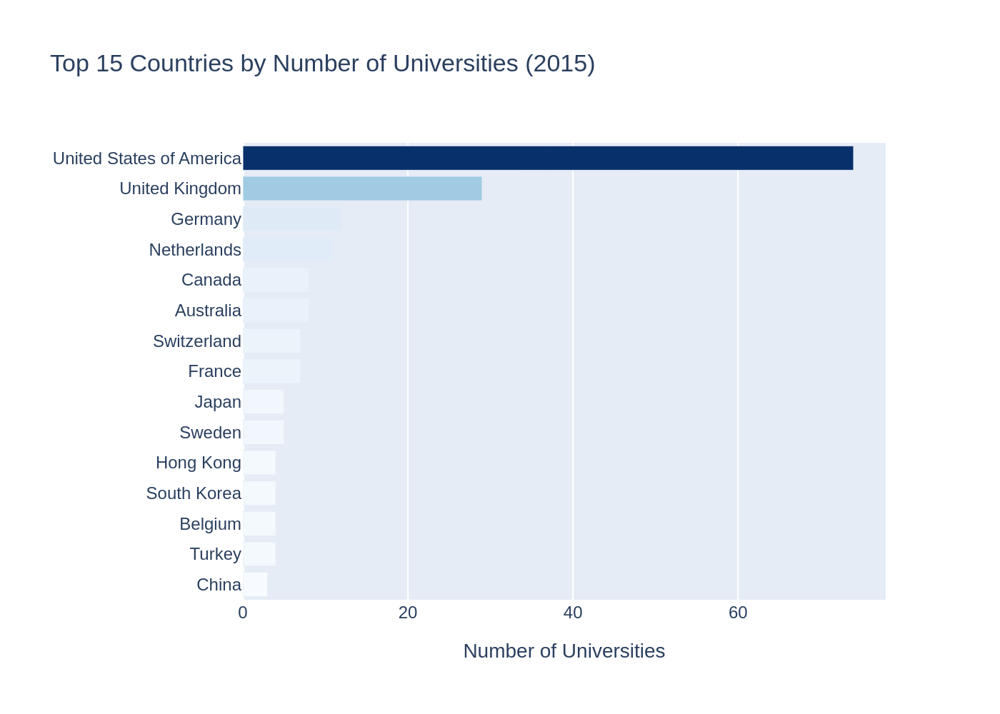
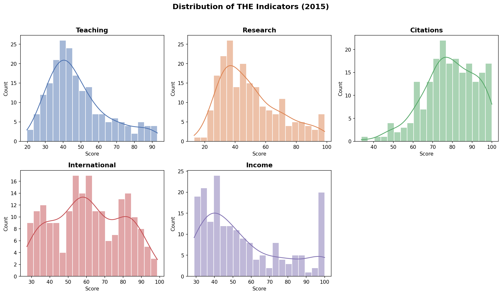
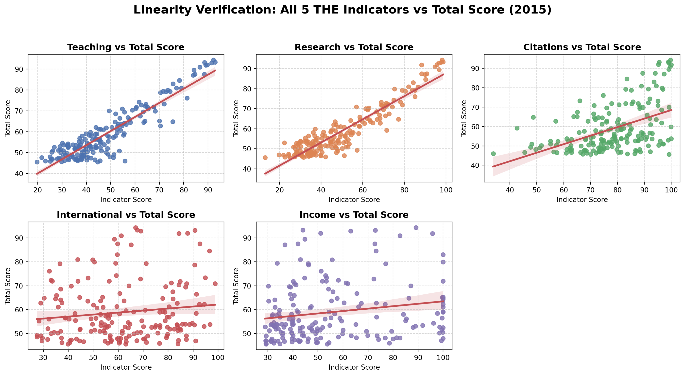

## The Problem

Every year, numerous university rankings are published globally. 

. . .

The *Times Higher Education (THE)* ranking is one of the most influential.

. . .

The official indicator weights are public. **But does the data actually match the methodology?**

. . .

- Is the ranking truly transparent?
- Which of the five indicators *truly* drives a university's final position?

## The Data

**Source Dataset:** 2,603 records | 818 Universities | 72 Countries

. . .

**Analysis Focus:** **2015** dataset (201 top universities).

. . .

**Preparation:**

- Excluded range ranks (e.g., "201-250")
- Handled missing values
- Removed irrelevant descriptive columns

## Geography of Global Leaders

The distribution of top universities is not even.

. . .

It shows massive geographical concentration:

- **United States:** 74
- **United Kingdom:** 29
- **Germany:** 12

## Geography of Global Leaders

{width="75%"}

## Score Distributions

How do the indicators behave statistically?

. . .

- **Citations:** 78.6 (High mean score)
- **Teaching & Research:** $\approx$ 49 (Moderate mean)
- **Income:** 55.5 (High variability)

## Score Distributions

{width="75%"}

## The Gradient Approach

How can actual empirical weights be found?

. . .

The final score $S$ must be treated as a mathematical function of five variables.

. . .

By applying linear regression, it is possible to extract the **gradient components**:

$$\nabla S = \left( \frac{\partial S}{\partial Teach}, \frac{\partial S}{\partial Res}, \frac{\partial S}{\partial Cit}, \frac{\partial S}{\partial Int}, \frac{\partial S}{\partial Inc} \right)$$

## Empirical vs. Official Weights

Is the THE ranking a "black box"?

. . .

**No.** The empirical calculations show near-perfect agreement with the stated methodology.

. . .

| Indicator | Empirical Weight | Official Weight |
|:---|:---:|:---:|
| **Teaching** | $\approx$ 30% | 30% |
| **Research** | $\approx$ 30% | 30% |
| **Citations** | $\approx$ 30% | 30% |
| **International** | $\approx$ 7.5% | 7.5% |
| **Income** | $\approx$ 2.5% | 2.5% |

## Linearity Verification

The relationship is strictly linear for the "Heavyweight Pillars".

. . .

*International* and *Income* show much higher dispersion.

## Linearity Verification

{width="80%"}

## Final Takeaways

**1. Transparency Confirmed**
The system is mathematically predictable. If you know the formula, you know the rank.

. . .

**2. Strategic Focus**
To reach the top, a university must excel in the "Big Three" (Teaching, Research, Citations) --- they control **90%** of the outcome.

. . .

**3. Geographical Bias**
The current 30/30/30 structure inherently favors the Anglo-Saxon university model, cementing the US and UK dominance.